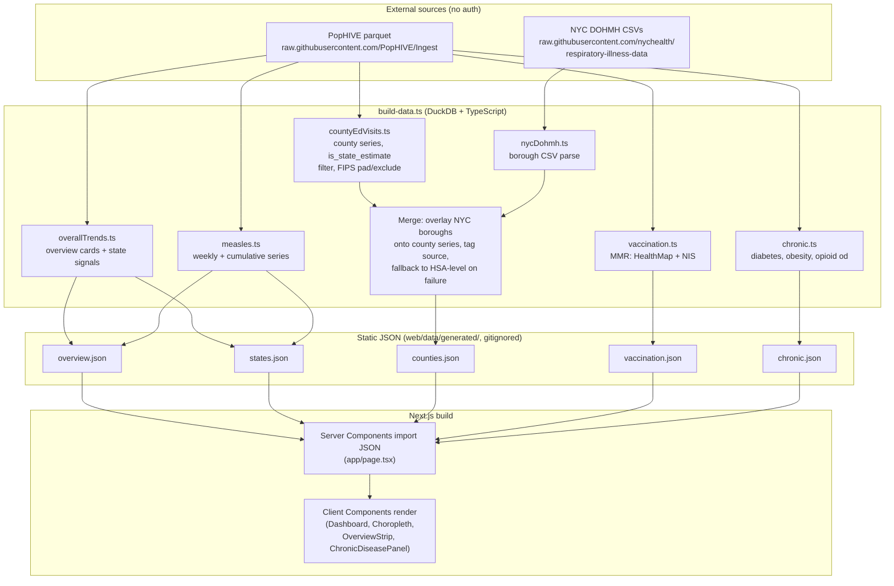
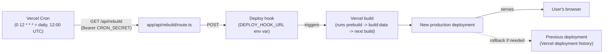
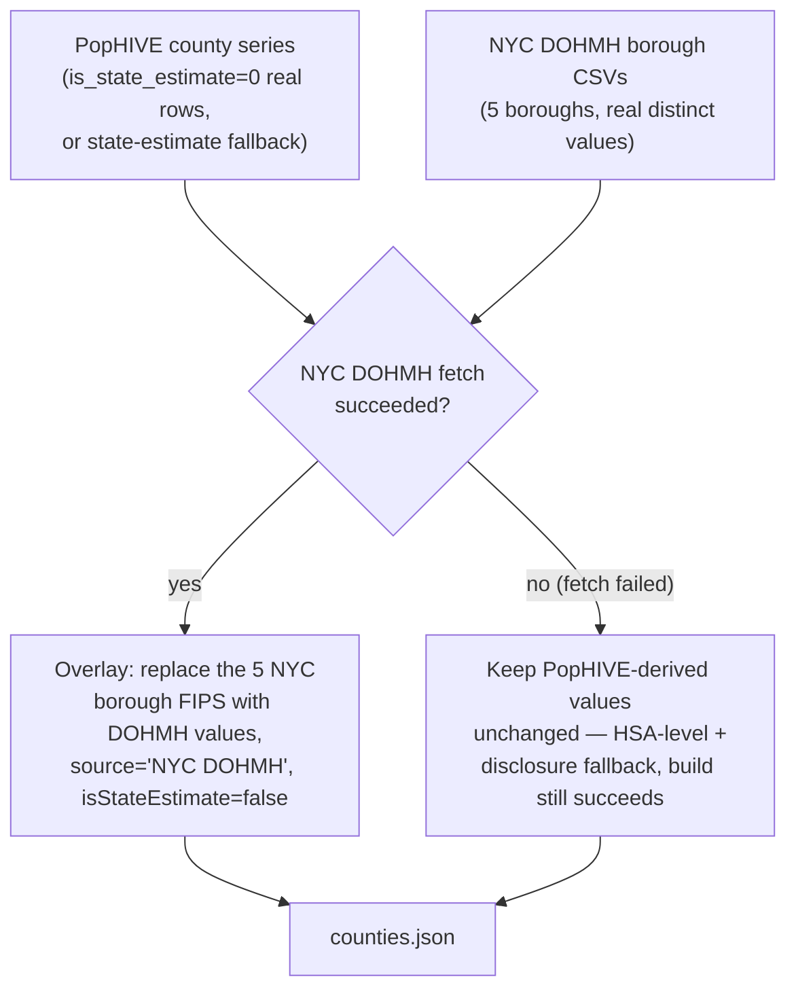

# Technical Specification

This is the technical source of truth for the delivered build. Update it in the same
milestone as any architectural, interface, data, configuration, or deployment change.

## System purpose and scope

- Purpose: A personal, hosted, self-refreshing dashboard of US public-health
  surveillance data sourced from PopHIVE.
- In scope: See `01-scope.md`.
- Out of scope: See `01-scope.md`.

## Architecture overview

Static site (Next.js 16, App Router — D-006) built locally today, targeting Vercel
hosting (M7, not yet deployed). A build-time data pipeline (`web/scripts/build-data.ts`,
run via `npm run build:data`, wired as the `prebuild` script) uses DuckDB (D-007) to
query PopHIVE parquet bundles directly from `raw.githubusercontent.com/PopHIVE/Ingest`
over HTTP, plus NYC DOHMH's own CSV data (D-008) for true per-borough figures, applies
data-quality transforms in SQL/TypeScript, and writes static JSON to
`web/data/generated/` (gitignored, regenerated every build). Server Components import
that JSON directly at build time; all interactivity (disease/signal selection,
drill-down, tab switching) happens client-side against the data already embedded in the
page — there is no runtime API or database.

### Build-time data flow



### Deployment / refresh loop (as built, M7)



Live at **https://web-six-sage-30.vercel.app** (Vercel project `surveillance-dashboard`,
scope `ben-a`; GitHub repo `akaheto/surveillance-dashboard`, private; Root Directory
`web`). The deploy hook was created via the Vercel REST API (`POST /v1/projects/{id}
/deploy-hooks`) since the CLI has no command for it and the dashboard UI wasn't scripted
against; `DEPLOY_HOOK_URL` and `CRON_SECRET` are stored as encrypted production
environment variables, not committed to the repo. Verified 2026-07-26: build succeeds
on Vercel's build image (confirms DuckDB's native binary works there, resolving R-002),
the deployed site serves correctly, the cron definition is registered against the
latest deployment, and `/api/rebuild` correctly returns 401 without the correct bearer
token.

### NYC borough blend (D-008)



Rendered from the Mermaid source above; regenerate the diagram images if this section
changes (see the Word-export note in this document's governance, if applicable).

## Components

| Component | Responsibility | Technology | Inputs | Outputs | Owner |
|---|---|---|---|---|---|
| Data pipeline | Fetch, clean, and transform PopHIVE + NYC DOHMH data into static JSON | `web/scripts/build-data.ts`, DuckDB (D-007) | PopHIVE parquet URLs, NYC DOHMH CSV URLs | 5 static JSON files | Claude Code |
| Choropleth map | Render state/county choropleth, tooltip, drill-down, tri-state highlight | `components/Choropleth.tsx` (d3-geo + us-atlas TopoJSON) | JSON series data | Rendered SVG map | Claude Code |
| Overview strip | Level/trend/% of 2-year peak per disease (measles: case counts, no level) | `components/OverviewStrip.tsx` | `overview.json` | Rendered cards | Claude Code |
| Dashboard (outbreak tracker) | Disease/signal selectors, drill-down state, tri-state toggle, vaccination panel | `components/Dashboard.tsx` | `states.json`, `counties.json`, `vaccination.json` | Rendered UI | Claude Code |
| Chronic-disease panel | Separate tab, own indicator selector | `components/ChronicDiseasePanel.tsx` | `chronic.json` | Rendered UI | Claude Code |
| NYC borough blend | Fetch + parse NYC DOHMH CSVs, merge into county data with fallback | `lib/nycDohmh.ts` | NYC DOHMH CSV URLs | `BoroughDatum[]` per disease | Claude Code |
| Scheduled rebuild | Trigger periodic redeploys | Vercel Cron + deploy hook | Schedule config | Redeploy trigger | Not yet built (M7) |

## Folder structure

```text
Public Health Tracker/            # git repo root
  Project Documents/              # PM/product docs (this file's folder)
  web/                            # Next.js application root
    app/
      page.tsx                    # Server Component: imports JSON, renders Dashboard
      layout.tsx
      globals.css                 # Design tokens (see 12-visual-style-guide.md)
    components/
      Dashboard.tsx                # Top-level client component, all interactive state
      Choropleth.tsx                # Map rendering, tooltip, legend
      OverviewStrip.tsx             # 4 status cards
      ChronicDiseasePanel.tsx       # Chronic-disease tab
    lib/
      pophive/
        duckdb.ts                  # DuckDB query helper
        fips.ts                    # FIPS padding/exclusion helpers
        states.ts                  # US state FIPS/name/abbr crosswalk
        types.ts                   # Shared data types
        bands.ts                   # Our own level/trend heuristics (documented as approximate)
        overallTrends.ts            # flu/covid/rsv overview + state series
        measles.ts                  # measles weekly/cumulative series
        countyEdVisits.ts           # county-level ED-visit series
        vaccination.ts              # MMR coverage (HealthMap + NIS)
        chronic.ts                  # diabetes/obesity/opioid-overdose
      nycDohmh.ts                  # NYC borough CSV fetch/parse
      topology.ts                  # us-atlas TopoJSON -> GeoJSON helpers
    scripts/
      build-data.ts                # Orchestrates the full pipeline, writes JSON
      inspect-bundle.mjs           # Dev tool: print schema/sample rows for any PopHIVE file
    data/generated/                # Output JSON (gitignored, regenerated every build)
```

## Code organization

| Module or package | Responsibility | Key interfaces | Dependencies |
|---|---|---|---|
| `lib/pophive/duckdb.ts` | Run a DuckDB query against a PopHIVE parquet URL | `queryParquet<T>(bundlePath, sqlFn)` | `duckdb` npm package |
| `lib/pophive/overallTrends.ts` | Build national overview cards + multi-signal state series for flu/covid/rsv | `buildOverviewCard(disease)`, `buildStateSignalSeries(disease, signal)` | `duckdb.ts`, `states.ts`, `bands.ts` |
| `lib/pophive/measles.ts` | Measles weekly/cumulative state series + national overview card | `buildMeaslesOverviewCard()`, `buildMeaslesWeeklySeries()`, `buildMeaslesCumulativeSeries()` | `duckdb.ts`, `states.ts`, `bands.ts` |
| `lib/pophive/countyEdVisits.ts` | County-level ED-visit series with state-estimate fallback | `buildCountySeries(disease)` | `duckdb.ts`, `fips.ts` |
| `lib/pophive/vaccination.ts` | MMR coverage from two independent sources | `buildMmrHealthmapSeries()`, `buildMmrNisSeries()` | `duckdb.ts`, `states.ts` |
| `lib/pophive/chronic.ts` | Diabetes/obesity/opioid-overdose state series | `buildDiabetesSeries()`, `buildObesitySeries()`, `buildOpioidOverdoseSeries()` | `duckdb.ts`, `states.ts` |
| `lib/nycDohmh.ts` | Fetch + parse NYC DOHMH's borough-level CSVs | `fetchAllBoroughData()` | Native `fetch` |
| `lib/topology.ts` | Convert `us-atlas` TopoJSON to GeoJSON feature collections | `usStates`, `usCounties`, `countiesForStates(fipsList)` | `topojson-client`, `us-atlas` |
| `scripts/build-data.ts` | Orchestrate all pipeline modules, merge NYC boroughs, write JSON | `main()` | All of the above |

## APIs and integrations

| API or service | Direction | Purpose | Authentication | Contract or version | Failure handling |
|---|---|---|---|---|---|
| PopHIVE raw parquet (`raw.githubusercontent.com/PopHIVE/Ingest`) | Inbound (fetch) | Source data for all panels | None (public) | Parquet files under `<bundle>/dist/<file>.parquet` | Build fails loudly rather than shipping partial/stale-without-disclosure data |
| PopHIVE MCP server (`https://mcp.pophive.org/mcp`) | Inbound (design-time only) | Used to produce reference figures and the in-chat preview; not part of the production pipeline (D-001) | None documented | MCP tools: `get_overview`, `get_current_status`, `get_trend`, `get_map`, `compare`, `get_coverage`, `get_data` | N/A — not used at runtime |
| Vercel Cron | Inbound (scheduler → deploy hook) | Trigger scheduled rebuilds | Vercel account-scoped | `vercel.json` cron config | Missed rebuilds are visible via stale `as_of` dates on the site |
| NYC DOHMH open data (`raw.githubusercontent.com/nychealth/respiratory-illness-data`) | Inbound (fetch) | True per-borough ED-visit % for flu/COVID/RSV (D-008, M3 outcome) | None (public) | `data/ED_data_{influenza,COVID-19,RSV}.csv`, wide format, one column per borough, updated weekly (Thursdays) | If a borough's row is missing/stale for the current week, that borough falls back to PopHIVE's HSA-level value with disclosure — never blocks the build |

### Confirmed NYC DOHMH schema (M3 spike, 2026-07-26)

Verified via direct fetch of the raw CSVs (not assumed from the repo's README):

- `ED_data_influenza.csv`, `ED_data_COVID-19.csv`, `ED_data_RSV.csv` — each:
  `date, {Disease} visits overall, visits 0-4, visits 5-17, visits 18-64, visits 65+,
  visits Bronx, visits Brooklyn, visits Queens, visits Manhattan, visits Staten Island,
  {Disease} hospitalizations overall, ...(same age/borough breakdown)`.
- Confirmed borough values are genuinely distinct per row (not a shared/duplicated
  value), unlike PopHIVE's NSSP HSA-level rows.
- Confirmed continuously updated through the same week as PopHIVE at check time
  (2026-07-18) — not gapped outside the Oct-May flu/RSV season as the repo's human-
  readable weekly bulletins might suggest; that description applies to the PDF
  bulletins, not this CSV feed.
- No measles file exists in this repo — measles has no per-borough source at all
  (PopHIVE's own measles data is state-level only), disclosed as such in the UI rather
  than silently omitted.

## Data model and storage

| Entity or store | Purpose | Key fields | Retention | Sensitivity |
|---|---|---|---|---|
| `overview.json` | 4 disease status cards | `OverviewCard` (disease, level, trend, pctOfPeak, asOf) / `MeaslesOverviewCard` | Regenerated each rebuild | None — public, aggregate, de-identified |
| `states.json` | State-level map data per disease/signal | `SignalSeries` (states: `StateDatum[]`, each `{stateFips, stateName, value, asOf}`) | Regenerated each rebuild | None |
| `counties.json` | County-level map data (flu/covid/rsv) | `CountySeries` (counties: `CountyDatum[]`, each `{countyFips, value, isStateEstimate, asOf, source?}`) | Regenerated each rebuild | None |
| `vaccination.json` | MMR coverage, 2 sources | `{mmrHealthmap, mmrNis}`, each a `SignalSeries` | Regenerated each rebuild | None |
| `chronic.json` | Diabetes/obesity/opioid-overdose | `{diabetes, obesity, opioidOverdose}`, each an `IndicatorSeries` | Regenerated each rebuild | None |

No PII/PHI: PopHIVE data is public, aggregate, and de-identified per its own governance
(see MCP server instructions).

## Configuration

| Variable or setting | Purpose | Required? | Default | Secret? |
|---|---|---:|---|---:|
| `DEPLOY_HOOK_URL` | Deploy hook the `/api/rebuild` route POSTs to | Yes | — | Yes — set as an encrypted Vercel production env var, not recorded here |
| `CRON_SECRET` | Bearer token `/api/rebuild` checks against, so only Vercel's own Cron invocations succeed | Yes | — | Yes — set as an encrypted Vercel production env var, not recorded here |
| Cron schedule | How often to rebuild | Yes | Daily, `0 12 * * *` (per A-003), in `web/vercel.json` | No |

Never record actual secret values.

## Dependencies

| Dependency | Version | Purpose | Update or compatibility notes |
|---|---|---|---|
| Next.js | Latest stable at scaffold time | Application framework (D-006) | — |
| d3-geo | Latest stable | Geographic projection math | — |
| us-atlas | Latest stable | US state/county TopoJSON | — |
| DuckDB (Node bindings) | Latest stable | Query PopHIVE parquet directly over HTTP, apply data-quality rules in SQL (D-007) | Validate native binary works in Vercel's build environment in M1 |

## Security and privacy

- Trust boundaries: Build-time fetches from two public, unauthenticated sources
  (PopHIVE parquet, optionally NYC DOHMH open data). No user-submitted data, no auth
  layer (personal, unlisted deployment).
- Authentication and authorization: None — single user, unlisted URL.
- Sensitive data handling: None — all source data is public/aggregate/de-identified.
- Validation and sanitization: Data-quality rules (suppression, FIPS exclusion, cadence
  separation) are the primary "validation" concern here, applied for correctness rather
  than security.
- Logging and audit: Not required for a personal single-user static site.
- Known risks: A failed or partial build could ship stale data; mitigated by failing the
  build loudly (see APIs and integrations) and always showing real `as_of` dates.

## Error handling and observability

- Error strategy: Build-time failures (fetch/parse errors, missing expected columns)
  fail the build rather than shipping partial data.
- Logging: Standard Vercel build logs.
- Metrics: None planned for v1 (personal project, no dashboard-of-the-dashboard).
- Alerts: None planned for v1; staleness is self-evident via the `as_of` date.
- Health checks: None planned for v1.

## Build, test, and deployment

- Local setup: `cd web && npm install`, then `npm run build:data` to generate JSON, then
  `npm run dev` (Next.js/Turbopack dev server).
- Build: `npm run build` runs `prebuild` (= `build:data`) automatically, then
  `next build`.
- Automated tests: None yet — see `05-tests.md`.
- Manual verification: Pipeline console output cross-checked against PopHIVE's own
  `get_current_status` calls and the brief's section 7 reference figures (exact matches
  confirmed for flu/RSV/COVID national status and HealthMap MMR coverage); full
  interactive browser verification completed 2026-07-26 (Chrome, desktop + 420px
  viewport) — see `08-project-plan.md` milestone completion notes for what was checked.
- Deployment: Live on Vercel (project `surveillance-dashboard`, scope `ben-a`) at
  https://web-six-sage-30.vercel.app, connected to the private GitHub repo
  `akaheto/surveillance-dashboard` (Root Directory `web`) — every push to `main` builds
  and deploys automatically. A daily Vercel Cron job (`web/vercel.json`) also triggers a
  rebuild independent of pushes, so the site refreshes even with no code changes.
- Rollback: Vercel's deployment history allows instant rollback to any
  prior build. Locally, git history serves the same purpose.

## Performance, reliability, and accessibility

- Expected load: Single user, low request volume — no scaling concerns.
- Performance requirements: None strict; static generation keeps page loads fast by
  default. Known cost: `counties.json` is ~1.2MB (all 3 respiratory diseases' county
  data shipped to the client at once) — acceptable for a personal tool, tracked as E-007
  (lazy-load per state) if it ever feels slow.
- Availability or recovery expectations: Personal project — best-effort; Vercel's
  platform reliability is sufficient once deployed.
- Accessibility requirements: Standard practice per the visual style guide (contrast,
  keyboard nav, focus visibility) — see `12-visual-style-guide.md`. Map state-click
  drill-down has a keyboard equivalent as of M7 (E-010): a "Jump to state" `<select>`.

## Technical limitations and debt

| Item | Impact | Workaround | Tracking reference |
|---|---|---|---|
| NYC boroughs may share one HSA-level NSSP value in the *national* map's county drill-down | Implies less precision than a true per-borough figure — but only in the national drill-down; the dedicated "Tri-State + NYC" view uses real DOHMH per-borough data | Explicit UI disclosure in the national drill-down; use "Tri-State + NYC" for real borough precision (D-008, resolved in M4) | R-001 (residual, scoped down), M4 |
| Static rebuild lags real-time by up to one cycle | Data can be briefly stale relative to a fresh PopHIVE pull | `as_of` date shown per panel | A-003 |
| DuckDB adds a native binary to the Vercel build | Slightly larger/slower build than a pure-JS reader | Confirmed working (2026-07-26): the Vercel build succeeded end-to-end on the first deploy — R-002 resolved, no revisit needed | D-007, R-002 resolved |
| `fips` column in NSSP-sourced bundles (flu/covid/rsv ED visits) is a `DOUBLE`, not a zero-padded string (e.g. `1007`, not `"01007"`) | Must reformat before matching TopoJSON county/state IDs, which expect zero-padded FIPS strings | Pipeline pads: 5 digits for county, 2 digits for state, before any geography join | M1 evidence, plan step 2 |
| `is_state_estimate` is a `DOUBLE` (0/1), not a boolean, across all bundles checked so far | Must compare `= 1` rather than truthy-check | Encode explicitly in the pipeline's filter logic | M1 evidence |
| The `flu`/`covid`/`rsv` ED-visit bundles have no `suppressed`/`suppressed_flag` column — only `is_state_estimate` | The brief's suppression rule doesn't apply uniformly to every bundle; must check per-file, not assume the column exists | Pipeline checks for the column's existence before applying suppression filtering | M1 evidence |
| `measles_county.parquet` uses a `geography` string column (e.g. `"00024"`) instead of `fips` — mostly standard zero-padded county FIPS (confirmed: values like `"01001"` match real Alabama counties), plus a small number of non-standard pseudo-codes | Resolved (Q-002, below): safe to join via exact-match against `us-atlas`'s known county set, silently dropping unmatched pseudo-codes. Not yet wired into the UI — measles county-level display is E-009, unscheduled | Join by exact FIPS match against the map's own county set rather than trusting the column blindly | Q-002 resolved 2026-07-26; E-009 |
| `measles_state.parquet` uses full state names (e.g. `"Alabama"`) in `geography`, and separates `cdc_measles_cases_nnds_cum` (cumulative, resets each January) from other measles sources by the `source` column | Must not chart cumulative and weekly measles sources together; must handle the January reset per the brief's data-quality rules | Pipeline branches on `source` and treats each as a separate series | M1 evidence, scope data-quality rules |

### Confirmed real bundle files (M1 schema discovery, 2026-07-25)

Verified via DuckDB `DESCRIBE`/`SELECT` against the live GitHub-hosted parquet files
(not assumed from the brief's docs site, which may lag):

- `bundle_respiratory/dist/flu_ed_visits_by_county.parquet` — `source, fips (DOUBLE),
  week_end (DATE), percent_visits_flu (DOUBLE), is_state_estimate (DOUBLE)`
- `bundle_respiratory/dist/covid_ed_visits_by_county.parquet` — same shape,
  `percent_visits_covid`
- `bundle_respiratory/dist/rsv_ed_visits_by_county.parquet` — same shape,
  `percent_visits_rsv`
- `bundle_measles/dist/measles_county.parquet` — `geography (VARCHAR),
  is_state_estimate (DOUBLE), date (DATE), year (INTEGER), week (INTEGER), source
  (VARCHAR), value (DOUBLE)`
- `bundle_measles/dist/measles_state.parquet` — `geography (VARCHAR, state name),
  date (DATE), year (DOUBLE), week (DOUBLE), source (VARCHAR), value (DOUBLE)`

Full file listing for `bundle_respiratory`, `bundle_measles`,
`bundle_childhood_immunizations`, and `bundle_chronic_diseases` was retrieved from the
GitHub contents API (`api.github.com/repos/PopHIVE/Ingest/contents/data/<bundle>/dist`)
to avoid guessing filenames; measles has no ED-visits-style file (it's tracked via case
counts, not NSSP visit %, which matches the brief's description). Childhood-immunization
and chronic-disease file schemas are not yet inspected — planned before M5/M6.

| ID | Type | Statement | Risk | Validation |
|---|---|---|---|---|
| Q-002 | `RESOLVED` (2026-07-26) | `measles_county.parquet`'s `geography` values are mostly standard 5-digit county FIPS, confirmed by matching known Alabama county codes; a small number of non-standard pseudo-codes exist alongside them | Low — resolved via exact-match-against-topology join strategy, not yet implemented (E-009) | Confirmed by direct inspection; safe join strategy identified, implementation deferred |

### Additional data-quality catches (M5/M6)

- `bundle_childhood_immunizations/dist/wapo_vax_counties.parquet`'s `wapo_county_vax_rate`
  didn't reconcile with its sibling file's per-school exemption-rate columns (e.g. a
  school with a 1% "overall rate" and 0% exemptions across all categories) — deferred
  rather than ship a possibly-mislabeled county vaccination metric (E-011).
- `bundle_chronic_diseases/dist/overdose_by_geography_and_source.parquet`'s `value`
  column produced implausible state overdose-death rates (~120-140 per 100k at the most
  recent date checked, against a real-world ceiling around 40-55) — used
  `overdose_deaths_state.parquet` instead, whose numbers passed a sanity check against
  known CDC ranges.

## Specification change log

| Date | Milestone | Technical change | Related decision |
|---|---|---|---|
| 2026-07-25 | Pre-M1 | Initial target architecture documented (not yet built) | D-001, D-002, D-003, D-004, D-005, D-006, D-007 |
| 2026-07-25 | M1 | Next.js scaffolded; DuckDB validated against real PopHIVE parquet; real schemas confirmed for flu/covid/rsv ED-visit and measles bundles | D-006, D-007 |
| 2026-07-25/26 | M2 | Data pipeline (overview, state, county series), Choropleth + OverviewStrip components, page wiring built and browser-verified | — |
| 2026-07-26 | M3 | NYC DOHMH research spike: confirmed real per-borough data exists | D-008 |
| 2026-07-26 | M4 | `lib/nycDohmh.ts` built; boroughs merged into county pipeline with fallback; Tri-State + NYC pinned panel | D-008 |
| 2026-07-26 | M5 | `lib/pophive/vaccination.ts` built (HealthMap + NIS MMR); vaccination panel paired with measles map | — |
| 2026-07-26 | M6 | `lib/pophive/chronic.ts` built (diabetes/obesity/opioid-overdose); separate Chronic Disease tab | — |
| 2026-07-26 | Post-M6 | Full interactive browser verification across M2-M6; two JSX whitespace bugs found and fixed | — |
| 2026-07-26 | Post-M6 | This document and `09-user-guide.md` updated from "target/TBD" to as-built content; architecture diagrams added | — |
| 2026-07-26 | M7 | Deployed to Vercel, connected to a new private GitHub repo; daily Cron + deploy hook wired for scheduled rebuild; DuckDB-on-Vercel risk (R-002) resolved | — |
